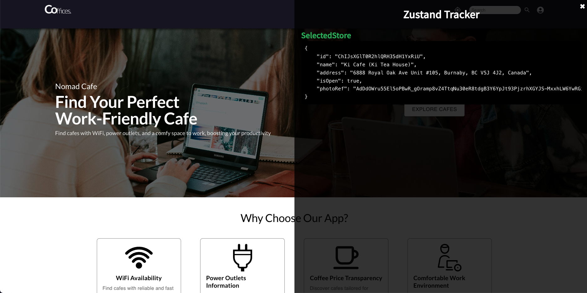

# 🐾 Zustand Tracker

Zustand Tracker is a lightweight 🛠️ React component designed for debugging Zustand stores. It provides a visual, interactive panel to inspect the state of multiple stores in real-time. Perfect for developers who want to stay in control of their app state! 🚀



## 📦 Installation

```bash
npm install zustand-tracker
```

or

```bash
yarn add zustand-tracker
```

## 🎉 Features

- Inspect Zustand stores in real-time.
- Toggle visibility with `Shift + Z`.
- Interactive UI for clear and structured data display.
- Fully customizable styles.

## 🚀 Usage

### Basic Example

Wrap the `ZustandTracker` in your application to debug Zustand stores.

```tsx
import React from "react";
import { ZustandTracker } from "zustand-tracker";
import useYourStore from "./yourStore";

export default function App() {
  const yourStoreData = useYourStore((state) => state);

  return (
    <>
      <ZustandTracker
        stores={{
          YourStore: yourStoreData,
        }}
      />
      {/* Your application components */}
      <div>Hello World</div>
    </>
  );
}
```

## 📝 Props

### `stores` (required)

- **Type**: Record<string, unknown>
- **Description**: The Zustand stores you want to debug. Provide the stores as a key-value pair, where each key is the store name and the value is the current state.

### `panelStyle` (optional)

- **Type**: `CSSProperties`
- **Description**: Customize the style of the debug panel. The following properties can be customized:

  - **`position`**: The CSS `position` property for the panel. Default is `"fixed"`.
  - **`top`**: Distance from the top of the viewport. Default is `0`.
  - **`right`**: Distance from the right of the viewport. Default is `0`.
  - **`width`**: Width of the debug panel. Default is `"50vw"`.
  - **`height`**: Height of the debug panel. Default is `"100vh"`.
  - **`background`**: Background color of the panel. Default is `"rgba(0, 0, 0, 0.8)"`.
  - **`color`**: Text color used in the panel. Default is `"white"`.
  - **`zIndex`**: The `z-index` of the debug panel. Default is `9999`.
  - **`overflowY`**: Control vertical overflow. Default is `"auto"`.
  - **`padding`**: Padding inside the debug panel. Default is `"20px"`.

## ⚠️ Warnings

If you're using Next.js, ensure you wrap the usage of `ZustandTracker` with "use client" to avoid server-side rendering issues:

```tsx
"use client";

import React from "react";
import { ZustandTracker } from "zustand-tracker";

export default function DebugWrapper({
  children,
}: {
  children: React.ReactNode;
}) {
  return (
    <>
      <ZustandTracker
        stores={
          {
            /* Your stores here */
          }
        }
      />
      {children}
    </>
  );
}
```

## ✨ Benefits

- Simplifies debugging for Zustand stores.
- Seamlessly integrates into your React app.
- Provides an interactive, developer-friendly interface.

## 🛠️ Contribute

Feel free to contribute to this project by creating issues or submitting pull requests on GitHub.

## ❤️ Support

If you love Zustand Tracker, don't forget to ⭐ it on GitHub and share it with your friends!

Happy Debugging! 🐾
